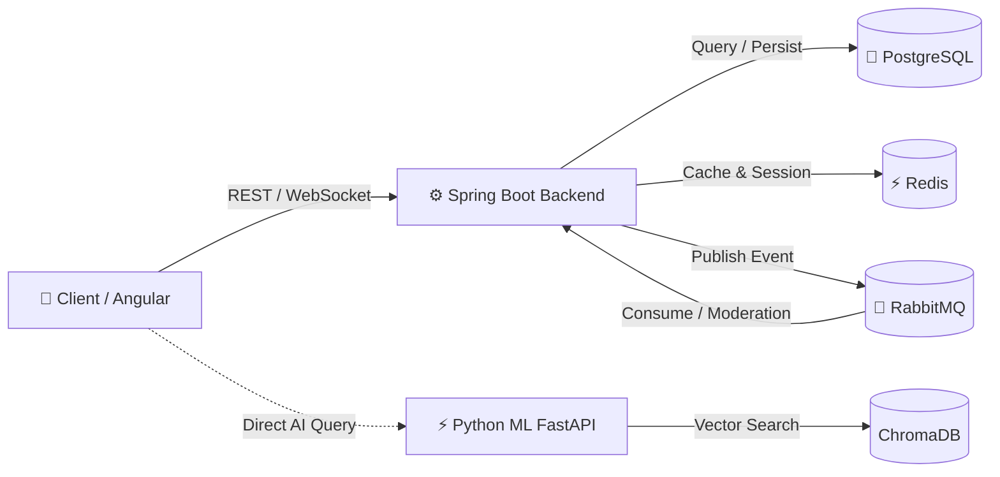

#  JurisHub - Nền tảng Tư vấn Pháp lý Thông minh

[](https://angular.io/)
[](https://spring.io/projects/spring-boot)
[](https://fastapi.tiangolo.com/)
[](https://www.postgresql.org/)
[](https://redis.io/)
[](https://www.rabbitmq.com/)

---

##  1. Giới thiệu
**JurisHub** là nền tảng số hóa dịch vụ tư vấn pháp luật, kết hợp công nghệ **Generative AI (RAG)** với mạng lưới **Luật sư** và **Cộng đồng hỏi đáp pháp lý**. Hệ thống giúp người dân tra cứu pháp luật nhanh chóng, đọc hiểu hợp đồng/văn bản PDF và kết nối trực tiếp với luật sư khi cần thiết.

---

##  2. Công nghệ sử dụng
- **Frontend:** **Angular** (TypeScript, Tailwind CSS, RxJS, WebSocket/STOMP client).
- **Backend Core:** **Spring Boot** (Java, Spring Security, JPA/Hibernate, Spring WebSocket, Spring Session).
- **AI & ML Engine:** **Python FastAPI** (LangChain, ChromaDB, Gemini/HuggingFace API, PyPDF).
- **Cơ sở dữ liệu & Message Broker:** **PostgreSQL 15** (DB chính), **Redis 7** (Caching & Session), **RabbitMQ 3.13** (Xử lý hàng đợi bất đồng bộ).
- **DevOps:** **Docker & Docker Compose**.

---

##  3. Tính năng cốt lõi
1. ** Trợ lý Pháp lý AI (RAG Q&A):** Hỏi đáp luật đa lượt, tự động tìm kiếm và trích dẫn điều khoản chính xác theo dữ liệu văn bản pháp luật Việt Nam.
2. ** Phân tích & Tóm tắt PDF:** Đọc hiểu tài liệu, trích xuất tóm tắt hợp đồng/văn bản luật và hỏi đáp trực tiếp theo ngữ cảnh file PDF.
3. ** Diễn đàn Pháp lý Cộng đồng:** Đăng câu hỏi, bình luận đa cấp, upvote/downvote câu trả lời hữu ích, phân loại theo chuyên mục luật.
4. ** Kiểm duyệt nội dung tự động (AI Moderation):** Sử dụng RabbitMQ xử lý ngầm (async) phân tích cảm xúc và phát hiện bài viết vi phạm tiêu chuẩn cộng đồng.
5. ** Kết nối Luật sư & Chat Real-time:** Danh bạ luật sư theo chuyên môn, nhắn tin tư vấn trực tiếp 1-1 qua WebSocket.
6. ** Quản trị viên (Admin Dashboard):** Báo cáo thống kê tương tác, quản lý người dùng, bài viết vi phạm và quota lượt dùng AI.

---

##  4. Kiến trúc tổng quan



---

##  5. Khởi chạy nhanh

### Cách 1: Sử dụng Docker Compose (Khuyến nghị)
```bash
# 1. Khởi chạy toàn bộ hệ thống
docker-compose up -d --build

# 2. Kiểm tra trạng thái
docker-compose ps
```

### Cách 2: Chạy từng service cho Development
1. **Khởi động hạ tầng:** `docker-compose up -d postgres redis rabbitmq`
2. **AI Service:**
   ```bash
   cd python-ml-service
   pip install -r requirements.txt
   uvicorn app.main:app --port 8000 --reload
   ```
3. **Backend Spring Boot:**
   ```bash
   cd backend
   ./mvnw spring-boot:run
   ```
4. **Frontend Angular:**
   ```bash
   cd frontend
   npm install
   npm start
   ```

---
